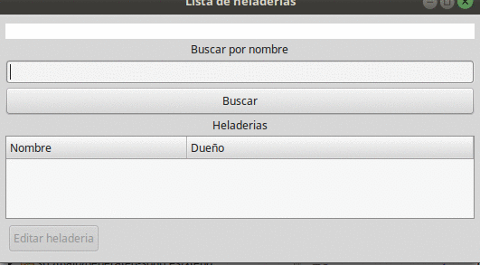

# Ejemplo Heladeria

 

Ejemplo que muestra 

* un modelo de datos compuesto por heladerías, que definen un mapa de gustos (strings) con dificultades de fabricación (integers)
* las heladerías pueden ser artesanales, económicas o industriales, implementadas con un enum
* hay además una relación many-to-one con su dueño
* el uso de dos sesiones permanentemente abiertas en la aplicación (se abandona solo cuando la aplicación de Arena se detiene. TODO: Debería forzarse el cierre de las sesiones al finalizar la aplicación)
* técnicamente, hay una sesión por cada repositorio
* la aplicación Arena hace una búsqueda y permite la edición de tres heladerías cargadas en el bootstrap
* para mostrar los gustos, la heladería transforma el mapa en una lista de gustos, a través del método Heladería>>gustosQueOfrece()
* para eliminar un gusto, la aplicación hace algo sucio (separa los valores y obtiene el gusto)

